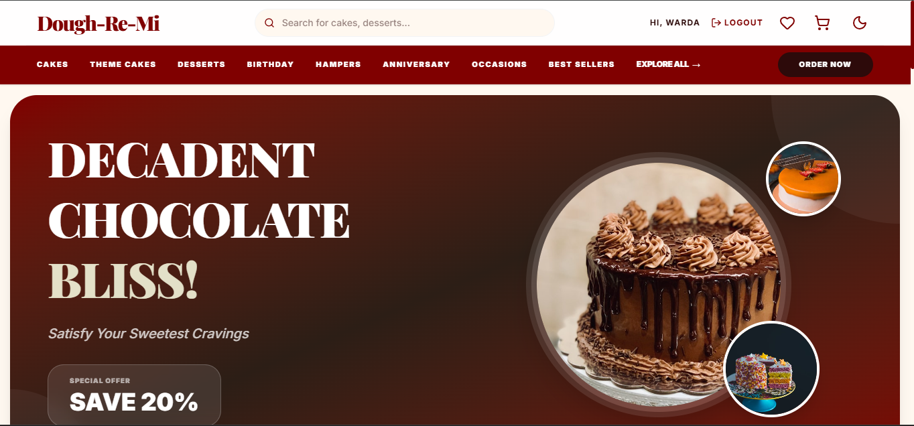
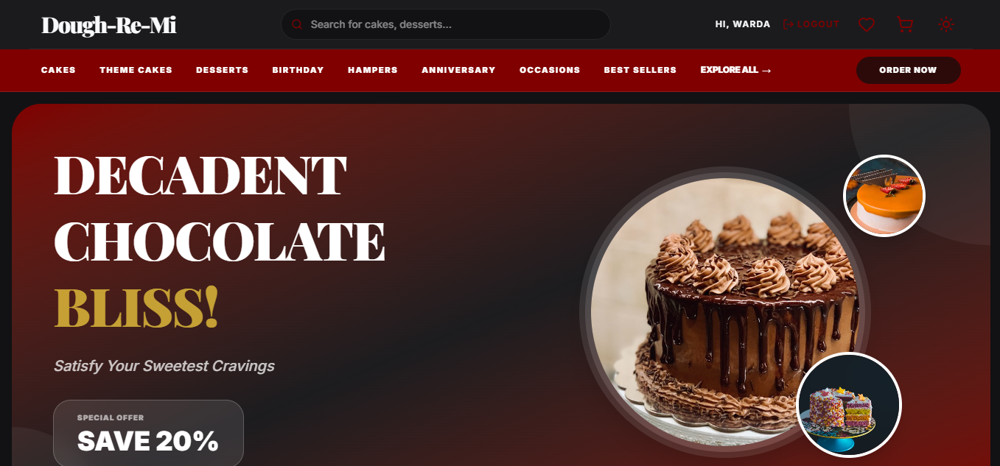
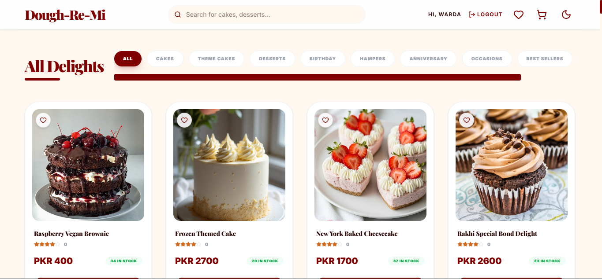
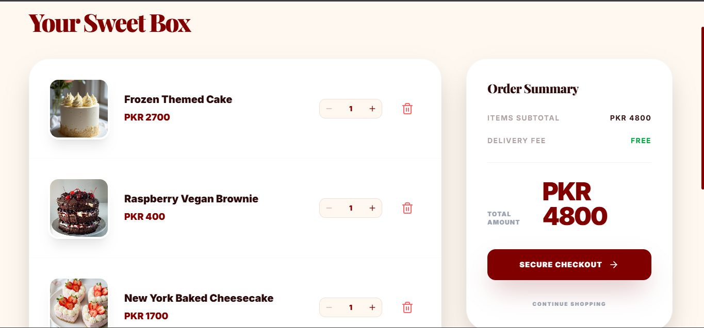
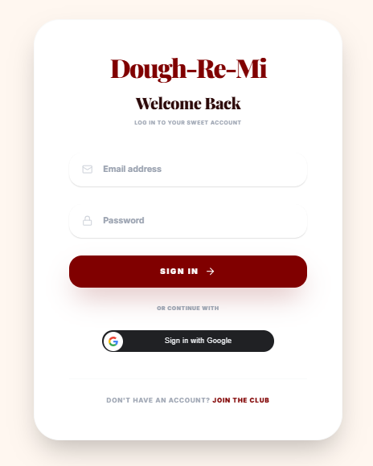
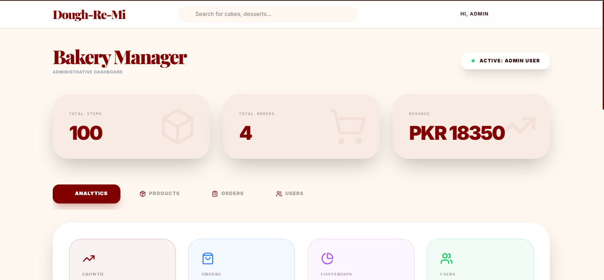

# 🍰 Syntecxhub E-Commerce Bakery App

A full-stack MERN (MongoDB, Express, React, Node.js) bakery e-commerce application built as part of the **Syntecxhub Internship Program**.

This project allows users to browse delicious bakery items, add them to cart, and place orders, while admins can manage products and track orders through a dedicated dashboard.

---

## ✨ Features

### 👤 User Side

* 🔐 JWT Authentication (Login & Signup)
* 🛍️ Browse bakery products
* 🧺 Add to cart & manage items
* 💳 Place orders
* 📦 View order history (optional)

### 🛠️ Admin Side

* 📊 Admin Dashboard
* ➕ Add / Edit / Delete Products
* 📦 Manage Orders (update status)
* 👥 View Users (optional)

---

## 🧰 Tech Stack

**Frontend:**

* React.js
* Tailwind CSS
* Axios

**Backend:**

* Node.js
* Express.js
* MongoDB (Atlas)
* JWT Authentication
* Bcrypt (password hashing)

---

## 🚀 Live Demo

🌐 Frontend: [https://your-frontend-link.com](https://your-frontend-link.com)
⚙️ Backend API: [https://your-backend-link.com](https://your-backend-link.com)

---

## 📂 Project Structure

```
Syntecxhub_Ecommerce
 ├── client        # React frontend
 └── server        # Node.js backend
```

---

## 🔑 Environment Variables

Create a `.env` file inside the `server` folder:

```
PORT=5000
MONGO_URI=your_mongodb_connection_string
JWT_SECRET=your_secret_key
```

⚠️ Do not commit `.env` file to GitHub.

---

## ⚙️ Installation & Setup

### 1️⃣ Clone the repository

```
git clone https://github.com/your-username/Syntecxhub_Ecommerce.git
cd Syntecxhub_Ecommerce
```

### 2️⃣ Backend Setup

```
cd server
npm install
npm run dev
```

### 3️⃣ Frontend Setup

```
cd client
npm install
npm start
```

---

## 📸 Screenshots

### 🏠 Home Page


### Dark Mode  Home Page


### 🛍️ Product Page


### 🧺 Cart Page


### 🔐 Login / Signup


### 📊 Admin Dashboard

---

## 🌟 Learning Outcomes

* Built a full-stack MERN application
* Implemented authentication & authorization
* Managed state and API integration
* Learned deployment and environment configuration
* Practiced Git & GitHub workflows

---

## 📌 Internship

This project was developed as part of the **Syntecxhub Internship Program**.

---

## 💖 Author

**Warda Khan**
Aspiring Full Stack Developer ✨

---

## 📢 Connect with me

* LinkedIn: [https://linkedin.com/in/your-profile](https://linkedin.com/in/your-profile)
* GitHub: [https://github.com/your-username](https://github.com/your-username)

---

⭐ If you like this project, don’t forget to star the repo!
